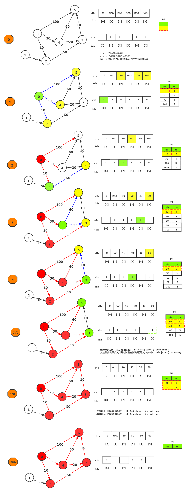

# Dijkstra算法python详细实现（最短路径）

## [Dijkstra算法思想](https://www.youtube.com/watch?v=KdzoDdRqes0&t=26s)

## [Dijkstra算法过程](https://www.youtube.com/watch?v=dHadKpKBZL4)

## [Dijkstra算法python详细实现](https://zhuanlan.zhihu.com/p/63395403)

它的主要特点是以起始点为中心向外层层扩展\(广度优先搜索思想\)，直到扩展到终点为止。

## [video python implement](https://www.youtube.com/watch?v=IG1QioWSXRI)

