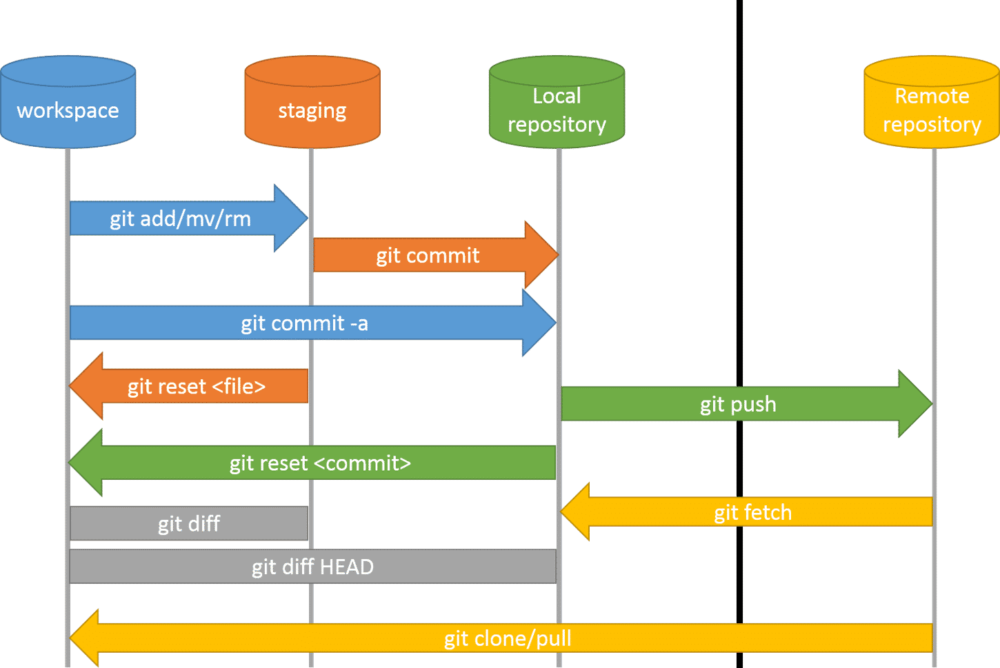

# Sorting

| Sorting | Best time complexity | Worst time complexity |
| :--- | :--- | :--- |
| Bubble Sort | O\(n\) | O\( $$n^2$$ \) |
| Selection Sort |  | O\( $$n^2$$ \) |
| Insertion Sort | O\(n\) | O\( $$n^2$$ \) |
| Shell Sort | O\( $$n^{1.3}$$ \) | O\( $$n^2$$ \) |

## Bubble Sorting

* First iteration: horizontal i times, index \(0, n-1-j\)
* Second iteration: vertical j times, index \(0, n-1\)


```python
#先写内层循环i（横向），再写纵向的外层循环j
def bubble_sort(alist):
  n = len(alist)
  for j in range(n-1):
    for i in range(0, n-1-j): #start from 0, the last digit is n-1
      if alist[i] > alist[i+1]:
        alist[i], alist[i+1] = alist[i+1], alist[i]

if __name__ == "__main__":
  alist = [54, 26, 93, 17, 77, 31, 44, 55, 20]
  print(alist)
  bubble_sort(alist)
  print(alist)
  
>>>[54, 26, 93, 17, 77, 31, 44, 55, 20]
>>>[17, 20, 26, 31, 44, 54, 55, 77, 93]
```

### Optimized bubble sort--for already sorted at the end of sequence

```python
#先写内层循环i（横向），再写纵向的外层循环j
def bubble_sort(alist):
  n = len(alist)
  for j in range(n-1):
    count = 0
    for i in range(0, n-1-j): #start from 0, the last digit is n-1
      if alist[i] > alist[i+1]:
        alist[i], alist[i+1] = alist[i+1], alist[i]
        count += 1
    if count == 0: #代表后面的已经排好序了
      return

if __name__ == "__main__":
  alist = [54, 26, 93, 17, 77, 31, 44, 55, 20]
  print(alist)
  bubble_sort(alist)
  print(alist)
```

## Selection Sorting

可以认为把一个序列分成两个，后面的是有序的，前面的是无序的，始终从前面无序的序列中找到最大值，放到后面有序的序列中。

每一个数字对应着index，每一轮检索时寻找最大值，标记出最大值的index，然后和最后的index互换

* 第1趟比较：拿第1个元素依次和它后面的每个元素进行比较，如果第1个元素大于后面某个元素，交换它们，经过第1趟比较，数组中最小的元素被选出，它被排在第一位。
* 第2趟比较：拿第2个元素依次和它后面的每个元素进行比较，如果第2个元素大于后面某个元素，交换它们，经过第2趟比较，数组中第2小的元素被选出，它被排在第二位。
* ......
* 第n-1趟比较：第n-1个元素和第n个元素作比较，如果第n-1个元素大于第n个元素，交换它们。


```python
def selection_sort(alist):
  n = len(alist)
  for j in range(0, n-1): # j: 0~n-2
    min_index = j
    for i in range(j+1,n):
      if alist[min_index] > alist[i]:
        min_index = i
    alist[j], alist[min_index] = alist[min_index], alist[j]

if __name__ == "__main__":
  alist = [54, 26, 93, 17, 77, 31, 44, 55, 20]
  print(alist)
  selection_sort(alist)
  print(alist)
  
>>>[54, 26, 93, 17, 77, 31, 44, 55, 20]
>>>[17, 20, 26, 31, 44, 54, 55, 77, 93]
```

## Insertion Sorting

把一个数列分为前后两个，前面的是有序的，后面的是原有的无序的。每一轮遍历都将新的数字和前面的有序序列的每一个元素比较，直到找到正确的位置插入。Selection Sorting操作的是无序序列（每一轮找到无序序列的极值），而Insertion Sorting操作的是有序序列的一侧。


```python
def insertion_sort(alist):
  n = len(alist)
  # 从右边的无序序列中取出多少个元素执行
  for j in range(1, n):
    # j = [1, 2, 3, ..., n-1]
    # i 代表内层循环起始值
    i = j
    # 执行从右边的无序序列中取出第一个元素，即i位置的元素，然后将其插入到前面的正确位置中
    while i > 0:
      if alist[i] < alist[i-1]:
        alist[i], alist[i-1] = alist[i-1], alist[i]
        i -= 1
      else:
        break

if __name__ == "__main__":
  alist = [54, 26, 93, 17, 77, 31, 44, 55, 20]
  print(alist)
  insertion_sort(alist)
  print(alist)
```

### Shell Sorting



